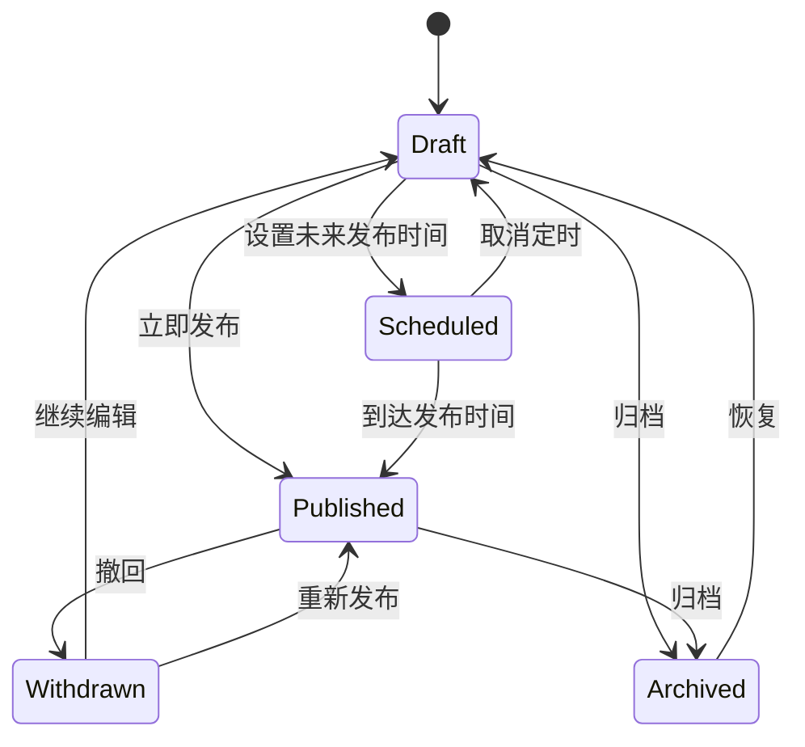

# Anywayone Blog 产品需求文档（PRD）

> 文档版本：v0.1  
> 产品阶段：MVP 规划  
> 产品形态：单作者个人博客  
> 适用端：Web 展示端、Admin 管理端、Backend 服务端

## 1. 产品概述

### 1.1 产品愿景

Anywayone Blog 是一套由作者完全掌控的个人内容发布系统，用于长期承载文章和摄影作品。它应让作者能够低摩擦地创作、管理和保存内容，让读者获得快速、安静、可检索的阅读与观赏体验，并让内容能够通过搜索引擎、RSS 和分享链接持续传播。

### 1.2 要解决的问题

对作者：

- 内容分散在第三方平台，排版、链接和资源不易迁移。
- 通用 CMS 功能繁杂，写作和发布链路反而变长。
- 很难同时兼顾 Markdown 写作、SEO、内容版本和站点个性化。
- 平台规则和推荐算法会干扰个人表达及内容所有权。

对读者：

- 博客常见加载慢、移动端体验差、广告或装饰干扰阅读的问题。
- 内容缺少清晰分类、搜索和相关推荐，历史文章不易发现。
- 代码、图片、目录和长文阅读体验不稳定。

### 1.3 产品目标

MVP 必须达成以下结果：

1. 作者可以完成从登录、写作、预览到发布的完整闭环。
2. 作者可以将一组照片整理为摄影集并发布，保留作品顺序和必要拍摄信息。
3. 读者可在桌面端和移动端快速阅读文章、浏览摄影作品并分享内容。
4. 已发布页面具备基础 SEO、RSS、站点地图和可访问性能力。
5. 内容、数据库和媒体文件可备份、恢复和迁移。
6. 单台普通云服务器即可稳定运行，维护成本适合个人项目。

### 1.4 非目标

MVP 不解决以下问题：

- 多租户建站或 SaaS 商业化。
- 多作者组织、投稿、审批和复杂角色权限。
- 微服务、分布式事务、大规模消息队列。
- 自研推荐算法、广告系统或复杂增长体系。
- 可视化拖拽建站、任意主题市场。
- 原生移动 App、小程序和离线优先写作。

## 2. 用户与场景

### 2.1 核心用户

| 用户 | 目标 | 典型任务 | 权限 |
| --- | --- | --- | --- |
| 站长/作者 | 高效创作并维护个人内容资产 | 写文章、上传图片、发布、修订、管理站点 | 全部后台权限 |
| 读者 | 快速获取和继续探索有价值的内容 | 阅读、搜索、按标签浏览、复制代码、订阅 RSS | 仅访问公开内容 |
| 搜索引擎/聚合器 | 稳定理解和索引站点 | 抓取正文、结构化数据、站点地图、RSS | 仅访问公开机器接口 |

### 2.2 核心用户故事

#### 作者

- 作为作者，我希望使用 Markdown 写作并实时预览，以便专注于内容而非排版。
- 作为作者，我希望文章自动保存草稿，避免浏览器关闭或网络波动导致丢稿。
- 作为作者，我希望设置别名、摘要、封面、标签和 SEO 信息，控制文章如何被发现和分享。
- 作为作者，我希望立即发布、定时发布或撤回文章，控制内容上线节奏。
- 作为作者，我希望查看历史版本并恢复，避免修改造成不可逆损失。
- 作为作者，我希望管理媒体文件和失效引用，保持内容资产整洁。
- 作为作者，我希望把多张照片按顺序组织成摄影集，并补充拍摄日期、地点和说明。

#### 读者

- 作为读者，我希望进入首页即可识别 Anywayone 的个人 IP，并能主动展开作者档案与站点日志。
- 作为读者，我希望长文有目录、阅读进度、代码复制和清晰排版。
- 作为读者，我希望通过分类、标签、归档和搜索找到历史内容。
- 作为读者，我希望页面链接稳定，旧链接变化后仍能找到内容。
- 作为读者，我希望使用 RSS 订阅更新，不依赖社交平台推荐。
- 作为读者，我希望在独立的摄影页面浏览作品集，并以沉浸但不牺牲加载速度的方式查看照片。

## 3. 产品范围

### 3.1 MVP 功能优先级

优先级定义：P0 为上线阻塞项，P1 为首个稳定版应具备，P2 为后续增强。

| 模块 | 功能 | 优先级 | 说明 |
| --- | --- | --- | --- |
| 身份认证 | 站长登录、退出、刷新会话 | P0 | 单管理员；禁止公开注册 |
| 文章 | 新建、编辑、删除、预览、发布、撤回 | P0 | Markdown 内容源 |
| 文章 | 自动保存、定时发布、版本历史 | P0 | 草稿安全是核心体验 |
| 内容组织 | 分类、标签、文章置顶 | P0 | 一篇文章一个分类、多个标签 |
| 媒体 | 图片上传、选择、替代文本、删除保护 | P0 | 删除前检查引用 |
| 前台 | 首页、文章、摄影、关于我四项一级导航 | P0 | 分类、标签、归档和搜索不占一级导航 |
| 摄影 | 摄影集创建、排序、预览、发布和撤回 | P0 | 一个摄影集包含多张有序照片 |
| 摄影 | 摄影列表、详情与大图查看 | P0 | 响应式图片和键盘操作 |
| 发现 | 标题/摘要/正文搜索 | P0 | 首版使用 PostgreSQL 全文搜索 |
| SEO | 元信息、canonical、Open Graph、JSON-LD | P0 | 每篇文章和摄影集可覆盖默认值 |
| 机器输出 | RSS、`sitemap.xml`、`robots.txt` | P0 | 仅包含可公开内容 |
| 站点配置 | 名称、简介、头像、社交链接、页脚 | P0 | 后台可配置 |
| 页面 | 联系页面 | P0 | 固定地址 `/about`，只展示头像、简短联系说明和已配置的联系方式 |
| 页面 | 其他自定义独立页面 | P1 | 不进入首版一级导航 |
| 数据 | 基础访问趋势、热门文章 | P1 | 隐私友好，不做用户画像 |
| 运维 | 导出、备份、健康检查、审计日志 | P1 | 保障可恢复性 |
| 评论 | 评论、审核、反垃圾 | P2 | 可接入第三方或自建 |
| 订阅 | 邮件订阅、退订、邮件推送 | P2 | RSS 优先验证需求 |
| 多语言 | 内容翻译与语言切换 | P2 | 数据层预留，不进入 MVP |

### 3.2 文章能力

#### 内容字段

- 标题：必填，建议不超过 80 个中文字符。
- Slug：默认由标题生成，可手动修改，在全站唯一。
- 摘要：可手动填写；为空时可从正文生成，仅作为兜底。
- 正文：Markdown 源文本，支持 GFM、代码块、表格、任务列表、脚注。
- 封面：可选，要求提供替代文本。
- 分类：可选且最多一个；标签可多选。
- 状态：草稿、定时、已发布、已撤回、已归档。
- 可见性：公开、不在列表中；私密文章延后实现。
- SEO：SEO 标题、描述、canonical URL、是否允许索引。
- 发布时间：立即或未来时间；显示时区以站点配置为准。

#### 编辑器行为

- 编辑器支持写作、分栏预览、纯预览三种视图。
- 内容发生变化后 2 秒防抖自动保存，并清晰显示保存状态。
- 本地保留最近未同步草稿；服务端冲突时不得静默覆盖。
- 离开有未保存修改的页面前进行提醒。
- 图片可拖拽/粘贴上传，完成后插入标准 Markdown。
- 标题层级异常、缺失图片替代文本、Slug 冲突时给出提示。

#### 发布规则

- 发布前检查标题、Slug、正文、摘要、时间和引用媒体是否有效。
- 首次发布生成发布时间；后续修改只更新修改时间。
- 更改已发布文章 Slug 时记录旧地址，并永久重定向到新地址。
- 撤回后前台不可见，但后台保留内容与历史版本。
- 定时发布任务需要幂等；任务重复执行不能造成重复事件。

### 3.3 展示端能力

#### 首页

- 首页用于建立个人品牌识别，不承担文章和摄影内容流；完整内容分别从“文章”和“摄影”一级导航进入。
- 第一屏占满 `100svh`，固定展示品牌标识、文案 `ANYWAY, BE YOUR ONE.`、主标语“不设限，做唯一的自己。”和透明背景全身 IP 形象。
- “了解更多”触发整页翻屏：内容壳上移，桌面端保留 80px、移动端保留 64px 的首屏提示区；固定导航始终可见。
- 第二屏只包含“关于我 / 站点日志”两个标签页和页脚；关闭操作恢复第一屏并将焦点返回“了解更多”。
- “关于我”标签承载完整个人档案，可包含简介、头像、属性、职业、位置、装备、标签、人格和跑步模块。
- “站点日志”标签可包含站点状态、客户端环境、文章/摄影统计、访问统计、趋势和站点纪事；站点纪事在最下方通栏展示。
- 个人资料和统计未配置时显示 `—` 或明确空状态，不得以演示数字或虚构经历填充。
- 首屏不使用自动播放媒体、雨效、音乐播放器或遮挡内容的弹窗。

#### 文章详情

- 展示标题、摘要、时间、阅读时长、正文、目录和标签。
- 支持代码高亮与复制、图片说明、脚注、表格横向滚动。
- 桌面端显示随阅读位置联动的目录；移动端使用可展开目录。
- 展示上一篇/下一篇及基于标签的相关文章。
- 提供原生分享入口或复制链接，不强依赖第三方 SDK。

#### 内容发现

- 分类页：按分类查看文章。
- 标签页：标签总览和标签文章列表。
- 归档页：按年份、月份浏览。
- 搜索页：输入关键词后返回标题、摘要和命中片段。
- 无结果时提供清空条件和返回全部文章的明确动作。

### 3.4 管理端能力

- 登录页：只提供登录和必要的安全提示，无注册入口。
- 工作台：草稿、已发布、待发布数量，最近编辑和基础访问趋势。
- 文章列表：按状态、分类、标签、时间和关键词筛选，支持批量操作。
- 文章编辑：编辑器、文章设置、SEO 预览、发布动作集中在一个工作流中。
- 摄影集：新建摄影集、批量选择照片、拖拽排序、编辑说明、预览和发布。
- 内容组织：分类、标签、首页个人档案和联系信息管理；一级导航结构固定。
- 媒体库：网格/列表切换、复制地址、引用状态和基础信息编辑。
- 站点设置：基础资料、外观偏好、SEO 默认值、社交链接、系统信息。
- 运维：数据导出、备份状态、登录与关键操作审计。

### 3.5 摄影能力

#### 摄影集字段

- 标题与 Slug：必填，公开地址为 `/photography/{slug}`。
- 简介：可选，用于说明主题、背景或拍摄过程。
- 封面：从摄影集照片中指定，不重复上传独立封面。
- 拍摄日期：可选，可表示某一天或起止日期。
- 拍摄地点：可选，首版只保存作者填写的地点文本，不保存精确坐标。
- 照片：至少 1 张；每张可设置标题、替代文本、说明和排序。
- 状态：草稿、已发布、已撤回；首版不支持摄影集定时发布。
- SEO：SEO 标题、描述、canonical URL、是否允许索引。

#### 展示规则

- 摄影列表按发布时间倒序，以封面、标题、拍摄时间和照片数量展示。
- 摄影详情保持照片原始宽高比，不做强制统一裁切。
- 列表和首屏使用派生图，原图不直接作为缩略图加载。
- 大图查看支持上一张、下一张、关闭、键盘和触控操作，并正确返回触发位置。
- EXIF 默认不公开；后续可让作者按摄影集选择性展示相机、镜头和参数。
- 首页不展示精选摄影集；完整浏览从“摄影”一级导航进入。

## 4. 状态与业务规则

### 4.1 文章状态机

删除采用回收站式软删除。进入回收站不等于归档；彻底删除需要二次确认，并保留于备份策略中。

### 4.2 Slug 与 URL

- 文章标准地址为 `/posts/{slug}`。
- 摄影集标准地址为 `/photography/{slug}`，关于我为 `/about`。
- 分类标准地址为 `/categories/{slug}`，标签为 `/tags/{slug}`。
- Slug 只允许小写字母、数字和连字符，中文标题默认生成拼音或要求作者确认。
- 已发布内容变更 Slug 时保存重定向记录，旧地址返回 `308`。
- 分页、筛选和搜索参数不应被当作 canonical 页面。

### 4.3 内容安全

- Markdown 渲染后的 HTML 必须经过白名单清洗。
- 默认不允许正文内任意脚本、iframe 和内联事件。
- 外链在新窗口打开时必须设置安全的 `rel` 属性。
- 上传文件按实际 MIME、扩展名、大小共同校验，并生成不可猜测对象键。

## 5. 非功能需求

### 5.1 性能

- 公开页面以生产环境第 75 百分位为目标：LCP ≤ 2.5 秒、INP ≤ 200 毫秒、CLS ≤ 0.1。
- 首页和文章页首个 HTML 响应目标 ≤ 500 毫秒（同区域、缓存命中场景）。
- 正文之外的统计、推荐等模块不得阻塞核心内容渲染。
- 响应式图片应提供尺寸信息、懒加载和现代格式。

### 5.2 可用性与兼容性

- 目标可用性：月度 99.5%，不以高成本多区域容灾为首版目标。
- 支持主流浏览器最近两个稳定版本；管理端不支持 IE。
- 前台从 360px 移动屏到宽屏桌面均可用。
- 核心操作满足 WCAG 2.2 AA 的键盘、对比度和语义要求。

### 5.3 安全

- 密码使用 Argon2id 哈希，永不记录明文或完整认证令牌。
- 登录限流；刷新令牌轮换；后台 Cookie 使用 `HttpOnly`、`Secure`、合理 `SameSite`。
- 所有管理写操作鉴权并记录审计；状态修改采用 CSRF 防护策略。
- 依赖与镜像持续扫描，高危漏洞阻止发布。
- 密钥由环境变量或密钥服务注入，不提交到 Git。

### 5.4 数据与恢复

- PostgreSQL 每日自动备份，建议保留 7 个日备、4 个周备、6 个月备。
- 对象存储开启版本控制或等效保护。
- 至少每季度执行一次恢复演练；“有备份”必须以“成功恢复过”为准。
- 内容支持 Markdown + JSON 元数据导出，降低系统迁移成本。

## 6. 成功指标

MVP 上线后首月关注质量和使用闭环，不以虚荣流量为主要目标。

| 维度 | 指标 | 目标 |
| --- | --- | --- |
| 发布效率 | 新建文章到成功发布的完整成功率 | ≥ 99% |
| 草稿可靠性 | 因系统原因造成的内容丢失 | 0 次 |
| 阅读性能 | 公开核心页面 Core Web Vitals 通过率 | ≥ 90% |
| 可发现性 | 已发布文章进入 sitemap 与 RSS 的正确率 | 100% |
| 稳定性 | 公开站点月度可用性 | ≥ 99.5% |
| 可恢复性 | 最近一次恢复演练 | 成功且有记录 |
| 内容产出 | 作者每月成功发布文章数 | 仅观察，不设强制 KPI |

## 7. MVP 验收场景

1. 作者登录后新建文章，输入 Markdown、粘贴图片，刷新页面后草稿仍完整。
2. 作者设置分类、标签、摘要和 SEO 信息，预览效果与公开页面核心排版一致。
3. 文章立即发布后可在首页、分类、标签、归档、搜索、RSS 和 sitemap 中发现。
4. 作者可创建摄影集、选择多张照片并排序，发布后可在摄影列表、详情和 sitemap 中发现。
5. 文章设置未来发布时间后，到点只发布一次；失败时可重试并可观测。
6. 修改已发布文章或摄影集的 Slug 后，旧链接永久重定向到新链接。
7. 撤回内容后，公开页面、搜索、RSS 和 sitemap 均不可再访问该内容。
8. 手机端能完成阅读、目录跳转、代码复制、摄影浏览和大图切换，不发生页面级横向溢出。
9. 备份可在空白环境恢复出数据库、文章、摄影集和媒体引用。

## 8. 后续版本方向

### v1.1：内容运营增强

- 自定义独立页面与页脚入口。
- 版本差异比较和更友好的恢复体验。
- 隐私友好的访问趋势和来源分析。
- Webmention 或轻量评论能力验证。

### v1.2：读者关系

- 邮件订阅、退订和文章推送。
- 评论审核、反垃圾和通知。
- 系列文章、专题集合、稍后阅读链接。

### v2：按需求演进

- 多语言内容。
- 联邦内容能力或 ActivityPub。
- 多作者与细分权限，仅在真实协作需求出现后立项。
