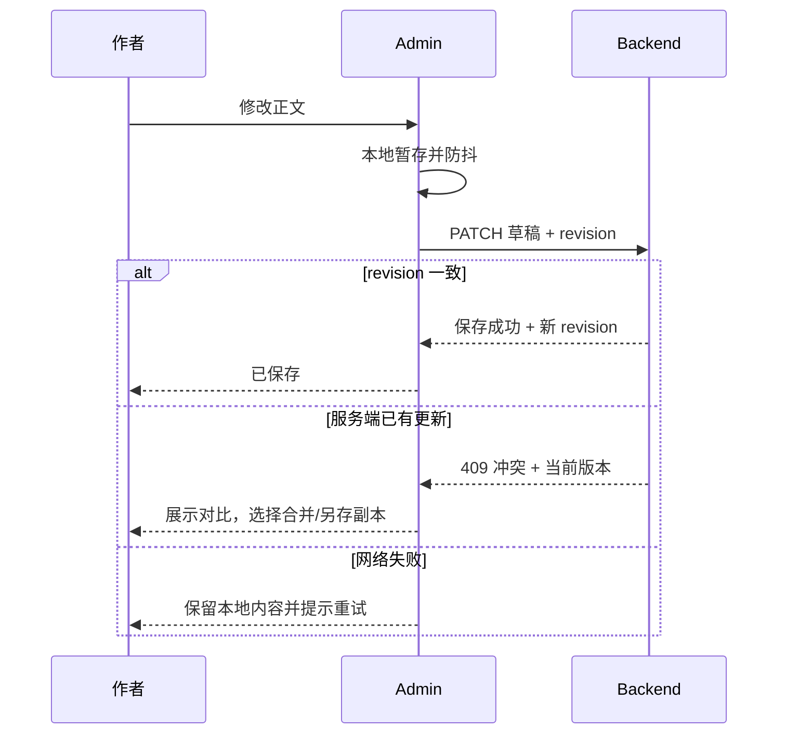
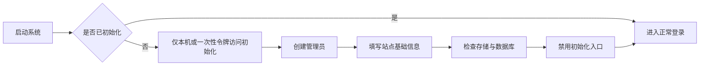
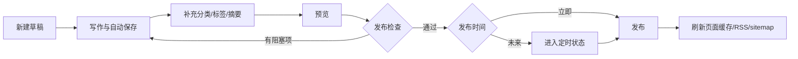

# Anywayone Blog 产品设计

## 1. 设计目标

Anywayone Blog 的设计重点不是“展示一个博客系统有多少功能”，而是让内容本身成为主角。

- 对读者：进入首页即可识别 Anywayone 的个人 IP；进入文章或摄影后，内容阅读和观赏过程保持安静、快速、连续。
- 对作者：高频工作集中在文章列表和编辑器，减少页面跳转和重复填写。
- 对系统：状态和反馈明确，不以隐式自动化替代用户对发布结果的控制。

## 2. 体验原则

1. 内容先于装饰：正文宽度、字号、行距、图片和代码体验优先。
2. 清晰先于新奇：导航、按钮、筛选和状态使用用户熟悉的模式。
3. 渐进披露：常用字段直接可见，高级 SEO 和发布选项按需展开。
4. 即时反馈：保存、上传、发布、失败和冲突都提供可理解的状态。
5. 可撤销：删除、撤回、批量操作等高风险动作提供确认或恢复入口。
6. 跨端连续：分享出去的筛选、搜索和目录位置应尽可能有稳定 URL。

## 3. 信息架构

### 3.1 展示端

```text
Anywayone Blog
├── 首页 /
├── 文章 /posts
│   ├── 文章详情 /posts/:slug
│   ├── 分类 /categories/:slug
│   ├── 标签 /tags/:slug
│   ├── 归档 /archives
│   └── 搜索 /search?q=
├── 摄影 /photography
│   └── 摄影集详情 /photography/:slug
├── 关于我 /about
├── RSS /rss.xml
└── 系统页面
    ├── 404
    └── 500
```

展示端一级导航固定为：首页、文章、摄影、关于我。分类、标签、归档和搜索属于文章的发现路径，从文章页、搜索入口或页脚进入，不占一级导航。首版只允许后台编辑“关于我”的内容，不开放一级导航删除和任意排序，保证站点结构与链接长期稳定。

### 3.2 管理端

```text
管理后台 /admin
├── 登录
├── 工作台
├── 内容
│   ├── 文章
│   ├── 摄影集
│   ├── 分类
│   ├── 标签
│   └── 关于我
├── 媒体库
├── 数据概览
├── 站点设置
│   ├── 基础信息
│   ├── 作者资料与社交链接
│   ├── SEO 默认值
│   └── 系统与备份
└── 账号与安全
```

## 4. 展示端页面设计

### 4.1 全局框架

#### 顶部导航

- 左侧：站点名称或文字标识，点击回首页。
- 中间/右侧：一级导航。
- 固定导航项：按顺序展示首页、文章、摄影、关于我。
- 工具：文章搜索；主站保持暖白主题，摄影详情按内容需要切换为独立暗色画布。
- 移动端：保留站点标识和搜索，导航收进菜单；打开后锁定背景滚动并正确管理焦点。

#### 页脚

- 作者版权、站点说明、RSS 和必要的社交链接。
- 可选显示备案信息和“最后构建时间”。
- 不放置大面积推荐卡片，避免干扰正文结束后的下一步选择。

#### 布局约束

- 主阅读栏建议 `680-760px`，正文每行约 35-45 个中文字符。
- 列表与筛选页内容区最大宽度建议 `1120-1200px`。
- 正文默认字号建议桌面端 17-18px、移动端 16-17px；不随视口连续缩放。
- 所有固定工具栏、代码块和表格必须在 360px 宽度下无页面级横向溢出。

### 4.2 首页

首页采用两段式个人品牌体验，只建立身份、展示个人档案和站点信息，不直接追加文章或摄影列表。

#### 第一屏：品牌首屏

- 占满 `100svh`；固定导航之下，左侧为主标语“不设限，做唯一的自己。”，英文口号作为辅助信息，右侧使用透明背景全身 IP 形象。
- 桌面端使用横版 Wordmark，移动端切换为 `A.` Logo；角色图可以被构图裁切，但脸部和主体动作必须完整可辨。
- “了解更多”是唯一首屏主动作。触发后内容壳整体上移，桌面端保留约 80px、移动端保留约 64px；固定导航不参与位移。
- 翻屏动效完成后，焦点进入第二屏标题或当前标签；关闭后恢复首屏，并把焦点返回触发按钮。

#### 第二屏：个人档案与站点日志

- 顶部使用“关于我 / 站点日志”标签切换，下方内容在同一页面区域更新。
- “关于我”可包含个人简介、头像、属性、职业、位置、装备、标签、人格和跑步模块；字段完全由后台配置。
- “站点日志”可包含站点状态、客户端环境、文章/摄影统计、访问统计、趋势和站点纪事；站点纪事在最下方通栏展示。
- 数据不可用时显示 `—` 或明确的“暂未记录”，模块保持稳定尺寸，不以虚构数据填满界面。
- 第二屏内容后直接进入页脚，首页到此结束。

状态设计：

- 角色图片失败：保留构图尺寸并显示品牌文字，不造成布局跳动。
- 数据加载失败：标签和已有内容仍可操作，失败模块提供重试。
- 减少动效：在 `prefers-reduced-motion` 下取消大幅位移，改用即时状态切换。

### 4.3 文章详情

```text
┌──────────────── 全局导航 ────────────────┐
│                                          │
│       标题                               │
│       摘要                               │
│       日期 · 阅读时长 · 分类             │
│                                          │
│  [正文阅读区]             [桌面端目录]    │
│  Markdown 内容                           │
│                                          │
│  标签 · 更新时间                         │
│  上一篇 / 下一篇                         │
│  相关文章                                │
│                                          │
└──────────────── 页脚 ────────────────────┘
```

关键交互：

- 阅读进度采用页面顶部细线，不遮挡内容。
- 目录从 `h2`、`h3` 生成；标题锚点可复制，滚动时考虑固定导航高度。
- 代码块显示语言名称和复制图标；复制后使用短暂状态反馈。
- 图片点击可查看大图，但键盘、关闭按钮和焦点返回必须完整。
- 外链提供视觉提示；新窗口打开遵循一致规则。
- 预计阅读时长不统计代码和元数据，并清楚表述为估算。
- 若文章更新较大，可在正文顶部或底部展示更新时间，不伪装为首次发布时间。

### 4.4 摄影

摄影列表以作品为主，不套用文章摘要卡片：

- 使用 2-3 列响应式网格，移动端为单列；封面保持摄影集设定的焦点与宽高比。
- 每项显示摄影集标题、拍摄日期/地点和照片数量，简介仅在有内容时显示。
- 图片进入视口前懒加载，并使用尺寸合适的 AVIF/WebP/JPEG 派生图。
- 摄影详情切换到炭黑沉浸画布，先展示标题、简短说明和拍摄信息，再按作者设定顺序展示照片。
- 照片流保持稳定尺寸，不采用会造成明显布局跳动的动态瀑布流。
- 点击照片进入大图查看；支持左右方向键、Esc、触控滑动和明确的关闭按钮。
- 大图查看时预加载相邻一张，不一次下载整组原图。
- 照片说明与替代文本职责分开：说明面向读者，替代文本面向无法看见图片的用户。

空摄影集不能发布。摄影页无内容时显示克制的空状态，不使用图库占位素材。

### 4.5 关于我

- 页面固定地址 `/about`，作为一级导航中的联系入口；页面标题对读者仍显示“关于我”。
- 只展示头像、简短联系说明和作者明确配置的邮箱、GitHub、微信等联系方式。
- 不重复首页第二屏的完整个人档案、装备、人格、跑步或站点统计。
- 未配置的联系方式不显示；邮箱默认不公开，只有作者主动启用时才展示。
- 微信等不适合直接跳转的渠道可展示账号或二维码，并提供清晰的复制/查看操作。

### 4.6 搜索

搜索按钮打开独立搜索页或轻量搜索面板；首版应确保搜索结果拥有可分享 URL。

- 输入 200-300ms 防抖，短于 2 个字符时不发送正文搜索请求。
- 支持标题、摘要和正文，标题权重最高。
- 结果展示命中片段，并对关键词做安全高亮。
- 可按分类和时间范围筛选，筛选值同步到 URL。
- 清空按钮使用明确图标和可访问名称。
- 搜索请求失败与“没有结果”是两个不同状态。

### 4.7 分类、标签和归档

- 分类总览适合表达稳定主题，可显示文章数和简短描述。
- 标签总览用于更细粒度主题，按名称或使用频次排序，不使用难以操作的 3D 标签云。
- 归档页按年份分组，组内按月和日期展示，默认展开最近年份。
- 所有列表复用一致的文章摘要组件和分页行为。

### 4.8 系统页面

- 404：明确说明页面不存在，提供回首页和搜索入口。
- 500：不暴露错误详情，提供重试和回首页；错误追踪 ID 可供排查。
- 维护状态：公开只读内容尽量由缓存继续服务，管理端明确提示暂停写操作。

## 5. 管理端页面设计

### 5.1 整体布局

- 桌面端为左侧主导航 + 顶部上下文栏 + 主工作区。
- 窄屏下侧栏折叠为抽屉；文章编辑器优先占满可用空间。
- 面包屑只在层级有帮助时出现，不与页面标题重复堆叠。
- 页面标题区最多保留一个主操作，例如“新建文章”。

### 5.2 登录

- 字段：账号/邮箱、密码、保持登录。
- 主操作：登录；不提供公开注册和无效的第三方登录入口。
- 错误信息避免透露账号是否存在。
- 连续失败后进行渐进式限流；出现验证码的前提是有真实攻击需要。
- 登录成功后回到原目标页面，默认进入工作台。

### 5.3 工作台

工作台是工作入口，不做复杂数据驾驶舱。

- 快捷操作：新建文章、继续最近草稿、上传媒体。
- 内容概览：文章草稿、待发布、已发布和摄影集数量。
- 最近编辑：标题、状态、最后保存时间、继续编辑入口。
- 基础趋势：近 7/30 天访问量、热门文章；数据不可用时不阻塞其他模块。
- 系统提醒：备份失败、定时发布失败、存储空间不足等可行动信息。

### 5.4 文章列表

列表列项：标题、状态、分类、标签、发布时间/计划时间、最后修改时间、操作。

交互规则：

- 默认按最后修改时间倒序；当前筛选和分页写入 URL。
- 常用筛选直接显示：状态、分类、关键词；其他筛选收纳在筛选面板。
- 行点击打开编辑，更多菜单包含预览、复制、撤回、归档、移入回收站。
- 批量操作只在选择后出现，且不允许对状态混杂内容执行含义不明的动作。
- 状态不仅依赖颜色，要同时有文字或图标。
- 删除已发布文章时说明外部链接将受影响，首步只移入回收站。

### 5.5 文章编辑器

推荐使用三段式结构：顶部操作栏、中央编辑区域、右侧设置面板。

#### 顶部操作栏

- 返回、文章状态、保存状态、预览、发布/更新。
- 发布是唯一强调的主按钮；已发布文章按钮文案改为“更新”。
- 更多菜单包含版本历史、复制文章、撤回和删除。

#### 编辑区域

- 标题输入与 Markdown 编辑区在同一主轴上。
- 工具栏使用熟悉图标，包含标题、粗体、斜体、链接、图片、引用、代码、列表等。
- 支持写作、分栏、预览模式；切换不得丢失光标或滚动位置。
- 分栏时尽量同步滚动，预览使用与前台一致的渲染组件和样式 token。
- 全屏专注模式隐藏非必要导航，但保留保存和退出入口。

#### 设置面板

按使用频率分组：

1. 发布：状态、时间、可见性、置顶。
2. 组织：分类、标签。
3. 展示：摘要、封面、封面替代文本。
4. 链接与 SEO：Slug、SEO 标题、描述、canonical、索引开关。

SEO 面板提供搜索结果和分享卡片预览，但明确其为近似效果。

#### 保存与冲突



“已保存”只能在服务端确认后显示；网络失败时显示本地保护状态，不能用成功文案掩盖风险。

### 5.6 发布流程

点击发布后打开轻量确认面板：

- 显示公开地址、发布时间、可见性和搜索索引状态。
- 发布检查以问题列表呈现，阻塞项与建议项分开。
- 阻塞项：标题/正文缺失、Slug 冲突、时间无效、引用媒体不存在。
- 建议项：摘要为空、封面缺少替代文本、标题层级跳跃、SEO 描述过长。
- 发布成功后提供“查看文章”和“继续编辑”，不自动把作者强制带离页面。

### 5.7 媒体库

- 支持拖拽上传、批量上传、网格/列表视图和关键词搜索。
- 上传进度逐文件展示；单个失败不取消已成功文件。
- 每个媒体展示尺寸、格式、大小、上传时间、替代文本和引用数量。
- 已被引用的媒体默认禁止直接删除，并列出引用文章。
- 原图保留，派生尺寸异步生成；作者可以复制原始地址或选择适合尺寸。

### 5.8 摄影集

- 列表展示封面、标题、状态、照片数量、拍摄时间和最后修改时间。
- 编辑页支持从媒体库批量选择照片，也支持直接上传后加入当前摄影集。
- 照片以稳定缩略图网格展示，支持拖拽排序和键盘调整顺序。
- 每张照片可编辑标题、替代文本和说明；批量保存时单张错误需要定位到具体照片。
- 摄影集设置包含 Slug、简介、拍摄时间/地点、封面、是否精选和 SEO。
- 发布前检查至少一张照片、封面有效、所有图片处理完成以及 Slug 唯一。
- 已被摄影集引用的媒体适用与文章相同的删除保护规则。

### 5.9 分类与标签

- 分类字段：名称、Slug、描述、排序；首版不支持无限层级，最多预留两级。
- 标签字段：名称、Slug；标签合并需要批量迁移文章关联并保留旧地址跳转。
- 删除前展示受影响文章数，可选择迁移到其他分类/标签。
- 系统阻止创建大小写或标准化后重复的名称。

### 5.10 站点设置

设置按主题分区并独立保存，避免一个巨大表单：

- 基础：站点名称、简介、Logo/头像、时区、默认语言。
- 作者：首页个人档案字段、头像和公开联系方式；`/about` 仅消费联系说明与已启用渠道。
- 社交：平台、链接、展示顺序；一级导航保持首页、文章、摄影、关于我的固定结构。
- SEO：默认标题模板、默认描述、分享图、索引策略。
- 内容：每页数量、摘要规则、RSS 条数、代码主题。
- 系统：版本、环境、存储状态、备份与导出。

## 6. 核心任务流程

### 6.1 首次部署与初始化



初始化不能成为长期暴露的公开注册入口。生产环境建议使用一次性初始化令牌或部署命令创建管理员。

### 6.2 写作到发布



### 6.3 修改已发布文章

- 保存修改先生成新版本，再更新当前内容。
- 若 Slug 未改变，更新原页面并触发缓存失效。
- 若 Slug 改变，创建旧 Slug 重定向后再更新。
- 更新失败时继续服务旧版本，不能让公开页面进入半更新状态。

## 7. 视觉方向

### 7.1 品牌气质

建议关键词：克制、清晰、温和、可信、带少量个人表达。避免产品后台和前台都被同一强调色铺满；内容页面应同时依赖中性色、正文色和少量强调色形成层级。

### 7.2 基础规范建议

| 项目 | 建议 |
| --- | --- |
| 字体 | 系统中文字体栈 + 适合代码的等宽字体，避免首屏阻塞型字体下载 |
| 圆角 | 控件 4-6px，卡片不超过 8px |
| 间距 | 以 4px 为基准，常用 8/12/16/24/32 |
| 颜色 | 中性色用于结构，一种品牌强调色用于链接和主操作，状态色语义固定 |
| 阴影 | 仅用于浮层、菜单和需要表达层级的组件 |
| 动效 | 150-250ms，尊重 `prefers-reduced-motion` |
| 图标 | 统一使用一套成熟图标库，不手绘风格混用 |

### 7.3 深色模式

- 默认跟随系统，允许用户切换并记忆选择。
- 正文、代码、图片说明、链接和边框都需要单独校验对比度。
- 服务端读取 Cookie 输出初始主题，避免页面加载时闪烁。
- 用户上传的透明图片需要在两种背景下可辨认，必要时提供可选衬底。

## 8. 文案原则

- 操作按钮使用动词，例如“发布”“撤回”“移入回收站”。
- 状态使用结果语言，例如“已保存”“等待发布”“发布失败”。
- 错误信息包含发生了什么和下一步能做什么，不展示后端堆栈。
- 高风险确认说明具体对象和影响，不使用笼统的“确定吗”。
- 时间同时考虑语义和精确性：列表可显示“3 小时前”，详情可展示完整日期。

## 9. 可访问性与响应式验收

- 所有核心流程可只用键盘完成，焦点顺序与视觉顺序一致。
- 图标按钮有可访问名称和悬停提示，表单错误与对应字段关联。
- 模态框打开后焦点进入，关闭后回到触发元素。
- 颜色不是状态的唯一表达方式。
- 正文标题层级连续，每页只有一个主标题。
- 200% 页面缩放时内容和操作仍可使用。
- 360×800、768×1024、1440×900 三类视口完成视觉回归检查。
- 长标题、长英文单词、宽表格、超长代码行和缺失图片都不破坏布局。
