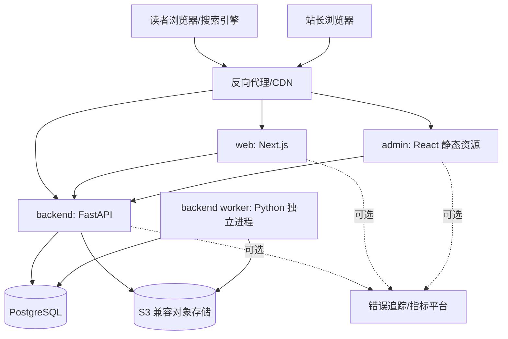
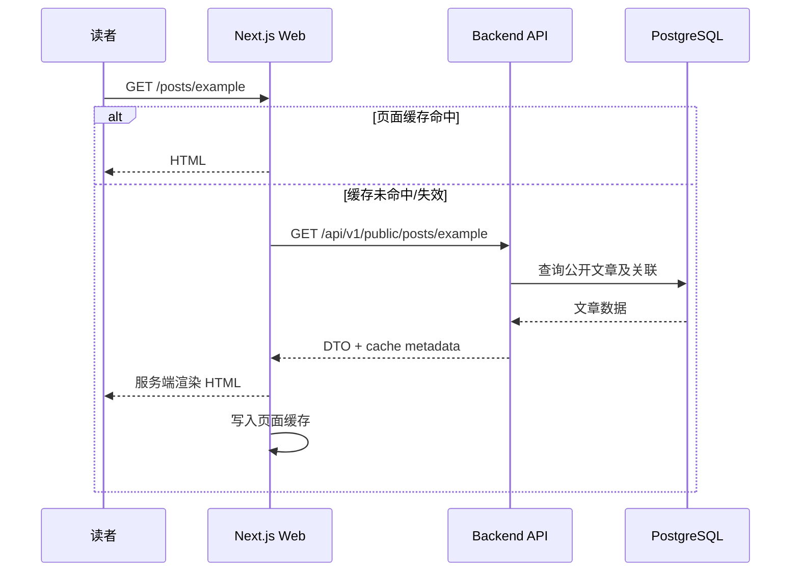
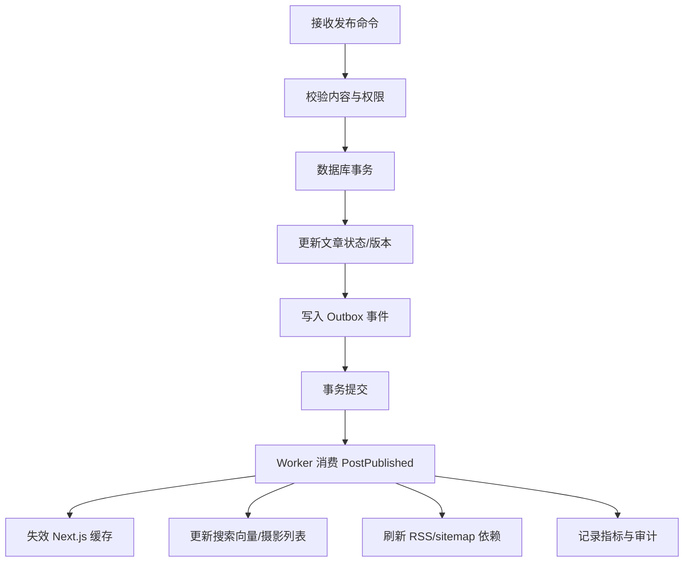

# Anywayone Blog 技术架构

## 1. 架构目标

技术架构服务于以下约束：单人或小团队开发、三端同仓、搜索引擎友好、低成本部署、内容可迁移、未来可渐进扩展。

首版采用“模块化单体 + 独立前端应用”，而不是微服务。FastAPI 后端在同一代码库内按业务模块隔离，API 与后台 Worker 可使用同一镜像启动为两个进程；管理端和展示端分别构建、部署，通过稳定 API 与后端通信。

## 2. 技术选型总览

| 层级 | 推荐技术 | 选择理由 |
| --- | --- | --- |
| 后端语言 | Python 3.11+ | 类型能力、异步生态和 FastAPI 支持成熟，版本下限明确 |
| 后端框架 | FastAPI | 基于类型注解、自动 OpenAPI、异步请求和依赖注入简洁 |
| ASGI 服务 | Uvicorn | FastAPI 官方常用部署路径，开发与生产配置简单 |
| 数据校验/配置 | Pydantic v2 + pydantic-settings | API DTO 与启动配置严格校验 |
| ORM | SQLAlchemy 2.0 async | 成熟、显式事务、异步访问和复杂查询能力完整 |
| PostgreSQL 驱动 | psycopg 3 async | 官方持续维护，与 SQLAlchemy 2.0 异步模式配合稳定 |
| 数据迁移 | Alembic | 与 SQLAlchemy 配套，迁移历史可评审和回滚 |
| Python 依赖 | uv + `pyproject.toml` | 锁定快、环境可复现，统一执行 lint/test/run |
| 前端语言/运行时 | TypeScript + Node.js LTS | 管理端和展示端保持类型安全与成熟生态 |
| 前端包管理 | pnpm workspace | 管理两个前端应用和 TypeScript 公共包 |
| 仓库任务入口 | Taskfile | 统一封装 `uv` 与 `pnpm` 命令，避免跨语言脚本分散 |
| 数据库 | PostgreSQL | 事务、JSONB、全文搜索和长期可扩展性较均衡 |
| 管理端 | React + Vite + Ant Design | 后台组件成熟，构建快速，复杂表单/表格支持完整 |
| 展示端 | Next.js App Router + React | SSR/SSG/ISR、Metadata、图片与 SEO 能力成熟 |
| 样式 | CSS Modules + Design Tokens | 博客主题可控，避免过度依赖组件样式；管理端复用 Ant Design token |
| 表单/请求 | React Hook Form + Zod / TanStack Query | 类型化校验、服务端状态和缓存管理清晰 |
| 编辑器 | CodeMirror 6 + Markdown 渲染链 | Markdown 原文可迁移，编辑能力可插件化 |
| Markdown | markdown-it-py + mdit-py-plugins + nh3 + Pygments | 后端统一解析、扩展、安全清洗与代码高亮 |
| 对象存储 | S3 兼容服务 | 可使用云厂商 S3、R2、OSS 兼容层或 MinIO |
| API 文档 | OpenAPI | 生成客户端、联调和契约测试 |
| 测试 | pytest + HTTPX + Testcontainers + Vitest + Playwright | 覆盖后端单元/接口、前端单元和端到端场景 |
| 代码质量 | Ruff + Pyright | Python 格式、lint 和静态类型检查 |
| 可观测性 | structlog + OpenTelemetry + Sentry 兼容错误上报 | 结构化日志、追踪和前后端错误定位 |
| 部署 | Docker Compose + Caddy/Nginx | 单机成本低，HTTPS 和反向代理清晰 |

### 2.1 为什么不选“全部 Next.js”

全部使用 Next.js 可以更快做出原型，但后台任务、独立管理端鉴权、审计和领域规则增加后，服务边界容易混杂。保留 FastAPI 后端能让内容规则集中、API 可独立演进；FastAPI 自动生成的 OpenAPI 还能作为 Python 后端与 TypeScript 前端之间的类型契约。

### 2.2 为什么首版不引入 Redis

定时发布、缓存和限流并不天然要求 Redis：

- 定时发布可由独立 Python Worker + 数据库状态 + 定时扫描 + 行锁实现。
- 公开内容主要使用 Next.js 页面缓存和反向代理缓存。
- 单实例登录限流可先使用进程内策略，生产上也可由反向代理提供基础限流。

当出现高并发异步任务、复杂重试队列或热点 API 缓存需求时，再引入 Redis，并选择 ARQ、Dramatiq 或 Celery 等 Python 任务框架。这样避免首版增加一个必须备份、监控和维护的有状态组件。

### 2.3 Python 版本与异步边界

- 项目声明 `requires-python = ">=3.11"`，开发、CI 和生产使用同一小版本线并提交 `uv.lock`。
- FastAPI 路由、SQLAlchemy Session、HTTP 客户端和对象存储调用使用异步接口。
- 图片编码、Markdown 大批量重建等 CPU 密集工作不在请求事件循环中执行，交给 Worker 或受控线程/进程池。
- 不为了“全异步”包装纯计算函数；领域规则保持普通同步函数，便于测试。

## 3. 总体架构



请求路径建议：

- `/`、`/posts/*`、`/photography/*` 与 `/about` 等公开页面由 `web` 处理。
- `/admin/*` 返回管理端静态应用。
- `/api/v1/public/*` 为公开读 API。
- `/api/v1/admin/*` 为后台鉴权 API。
- `/media/*` 可直接使用 CDN/对象存储域名，不经后端转发大文件。

## 4. 推荐仓库结构

```text
Anywayone-blog/
├── admin/                    # React + Vite 管理端
│   ├── src/
│   │   ├── app/             # 路由、Provider、应用初始化
│   │   ├── features/        # 按业务功能组织
│   │   ├── components/      # 管理端通用组件
│   │   └── styles/
│   └── package.json
├── backend/                  # FastAPI 模块化单体
│   ├── app/
│   │   ├── api/             # 路由与 HTTP 依赖
│   │   ├── modules/         # 业务模块
│   │   ├── core/            # 配置、安全、日志、异常
│   │   ├── db/              # Session、Base、数据库工具
│   │   ├── tasks/           # 定时扫描与 Outbox 消费
│   │   ├── main.py          # FastAPI 应用入口
│   │   └── worker.py        # Worker 进程入口
│   ├── alembic/
│   │   └── versions/
│   ├── tests/
│   ├── alembic.ini
│   ├── pyproject.toml
│   └── uv.lock
├── web/                      # Next.js 展示端
│   ├── app/
│   ├── components/
│   ├── features/
│   ├── lib/
│   └── package.json
├── packages/
│   ├── api-client/           # 由 OpenAPI 生成的请求客户端
│   ├── design-tokens/        # 颜色、间距、排版 token
│   ├── eslint-config/
│   ├── tsconfig/
│   └── test-utils/
├── doc/
├── infra/
│   ├── compose/
│   ├── proxy/
│   └── scripts/
├── .github/workflows/
├── Taskfile.yml              # 跨 Python/Node 的统一任务入口
├── package.json
├── pnpm-workspace.yaml
└── pnpm-lock.yaml
```

`pnpm workspace` 只管理 `admin`、`web` 和 TypeScript 公共包，Python 后端由 `uv` 独立锁定。根目录 `Taskfile.yml` 提供 `dev`、`lint`、`test`、`build`、`migrate` 等统一入口。

公共包只放两个前端真正共享且稳定的能力。禁止手写一套与 Python 模型重复的 TypeScript DTO；前端只依赖 FastAPI OpenAPI 生成的客户端类型，避免数据库结构泄漏到客户端。

## 5. 后端模块设计

```text
backend/app/modules/
├── auth              # 登录、刷新、退出、会话、限流
├── users             # 管理员账号与安全设置
├── posts             # 文章、状态机、发布规则、版本
├── photography       # 摄影集、照片排序、发布规则
├── taxonomy          # 分类、标签和关联
├── pages             # 联系页内容；P1 扩展其他独立页面
├── media             # 上传签名、元数据、引用检查、派生图
├── search            # PostgreSQL 全文索引与查询
├── settings          # 站点配置、作者资料、社交链接
├── redirects         # 旧 Slug 与永久重定向
├── analytics         # 基础聚合数据，可关闭
├── audit             # 关键操作日志
├── export            # Markdown/JSON 导出与备份元数据
└── health            # 存活、就绪和依赖检查
```

每个模块内部推荐分层：

```text
posts/
├── router.py         # FastAPI 路由，只做协议转换
├── schemas.py        # Pydantic 请求/响应模型
├── service.py        # 用例：创建、保存、发布、撤回
├── domain.py         # 状态与不变量，不依赖 FastAPI/SQLAlchemy
├── models.py         # SQLAlchemy 映射
├── repository.py     # 查询与持久化边界
└── events.py         # 领域/Outbox 事件定义
```

不必为所有简单 CRUD 强行建立复杂领域层，但文章/摄影集发布、版本冲突、媒体引用等关键规则必须集中在 service/domain，不能散落在路由函数或前端。

## 6. 关键技术流程

### 6.1 公开文章读取



公开文章 DTO 只返回后端已安全生成的 HTML 与目录，不返回 Markdown 源文。FastAPI 在保存/发布流程中通过统一 Python 渲染服务生成 HTML 和目录并持久化；Admin 预览调用同一渲染服务，Web 只负责展示经过验证的结果，从而避免前后端渲染规则漂移。

### 6.2 保存与版本控制

- 客户端提交 `revision` 或 `If-Match` 值。
- 后端在事务中比较当前版本；不一致返回 `409 CONTENT_VERSION_CONFLICT`。
- 保存成功后增加 revision，并按策略创建文章版本快照。
- 建议每次显式保存/发布都建版本；自动保存按时间窗口合并，避免版本爆炸。
- 版本快照至少包含标题、摘要、Markdown、元数据和操作者。

### 6.3 发布文章



使用数据库 Outbox 保证内容状态与后续事件不会因进程中断而永久不一致。首版 Worker 与 API 使用同一代码和镜像，但作为独立进程运行；消费逻辑必须幂等。摄影集发布复用同一机制，事件类型使用 `PhotographyPublished`。

### 6.4 定时发布

每 30-60 秒扫描 `status = SCHEDULED AND scheduled_at <= now()` 的记录，使用 `FOR UPDATE SKIP LOCKED` 或等效原子更新获取任务。发布仍调用同一个发布用例，保证立即发布和定时发布规则一致。

关键约束：

- 数据库存 UTC，后台按站点时区输入和展示。
- 同一文章重复执行不会产生重复发布结果。
- 失败记录错误与重试次数，超过阈值产生管理端提醒。
- 多实例部署时仍只有一个实例成功获取同一条记录。

### 6.5 图片上传

推荐浏览器直传对象存储：

1. Admin 向 Backend 请求上传凭证，提交文件名、大小、MIME。
2. Backend 校验后创建媒体草稿并返回短时效预签名 URL。
3. Admin 直接上传对象存储。
4. Admin 通知 Backend 完成上传。
5. Backend 读取真实对象信息，确认 MIME/大小，生成派生图并标记可用。

预签名 URL 只允许指定对象键、类型、大小和短有效期。若使用本地适配器，API 可以接收文件，但业务接口保持一致。

## 7. 内容渲染架构

Markdown 处理由 Python 后端统一执行：

```text
Markdown
  -> markdown-it-py 解析 token tree
  -> mdit-py-plugins（表格、任务列表、脚注等白名单扩展）
  -> 自定义规则（标题 ID、目录、图片元数据、阅读时长）
  -> Pygments 代码高亮
  -> nh3 HTML 白名单清洗
  -> HTML + TOC + excerpt
```

规则：

- 安全清洗必须是白名单，插件新增 HTML 能力时同步更新测试。
- 代码高亮尽量在发布/服务端阶段完成，避免前台加载大型运行时。
- 标题 ID 算法稳定，修改正文其他位置不应改变已有标题锚点。
- 图片渲染统一注入宽高和响应式资源，降低 CLS。
- Mermaid、数学公式等扩展按内容需求增加，首版不要一次装入所有插件。
- Admin 的预览接口复用该服务；浏览器本地预览只能作为断网时的临时辅助，不能作为发布结果的事实来源。

## 8. API 与鉴权

### 8.1 API 风格

- 基础前缀：`/api/v1`。
- 公开读：`/public`；管理操作：`/admin`。
- JSON 字段统一 `camelCase`，数据库字段可使用 `snake_case`。
- 时间使用 ISO 8601 UTC，例如 `2026-08-27T03:00:00Z`。
- 列表使用游标或页码应按场景统一；后台普通管理列表首版可用页码，公开时间流可后续改游标。
- 写接口支持幂等键的场景：上传完成、发布、导出任务等。

### 8.2 登录与会话

推荐 Web 管理端使用同站点安全 Cookie：

- 短期访问会话 + 可轮换刷新令牌。
- 刷新令牌只保存哈希，退出或检测复用时吊销令牌族。
- Cookie 为 `HttpOnly`、生产环境 `Secure`，设置明确 Path 和 SameSite。
- 写请求采用 SameSite、Origin 校验与 CSRF Token 的组合防护。
- 认证接口与普通 API 分别限流。

后台静态应用与 API 最好通过同一站点域名提供，例如 `example.com/admin` 与 `example.com/api`，减少跨域和 Cookie 复杂度。

## 9. 数据库与搜索

### 9.1 数据库原则

- 所有主键使用 UUID v7、ULID 或数据库生成 UUID；项目内统一一种。
- 时间统一 UTC，并保留 `created_at`、`updated_at`。
- 内容删除默认软删除，唯一索引需考虑已删除行。
- 状态使用受约束字符串或数据库枚举，迁移策略需可回滚。
- Alembic migration 纳入版本控制，生产环境只执行已评审迁移；禁止依赖应用启动时自动建表。

### 9.2 首版全文搜索

使用 PostgreSQL `tsvector` + GIN 索引：标题权重 A、摘要 B、正文 C、标签 B。中文搜索需要选择合适的分词方案：

- 简单起步：`pg_trgm` 做模糊匹配，标题/摘要效果较稳定。
- 中文内容增多：启用 PostgreSQL 中文分词扩展，前提是部署环境可稳定安装。
- 规模或体验要求上升：迁移至 Meilisearch/OpenSearch，保留 `search` 模块接口。

不要在产品需求尚未验证时直接引入独立搜索集群。

## 10. 缓存策略

| 层级 | 内容 | 策略 |
| --- | --- | --- |
| 浏览器/CDN | 图片、字体、构建产物 | 文件名带 hash，长期不可变缓存 |
| CDN/代理 | 公开 HTML、RSS | 短缓存 + stale-while-revalidate |
| Next.js | 首页、文章、摄影、关于我、分类、标签 | 按内容 tag 失效，必要时 ISR |
| API | 公开只读接口 | ETag/Last-Modified，按需短缓存 |
| Backend | 设置等低频数据 | 首版可用进程内短缓存，写后失效 |

文章或摄影集的发布、撤回、删除和 Slug 修改必须触发相关缓存失效。若失效调用失败，通过 Outbox 重试；缓存中的旧内容应有合理最大生存期。

## 11. 安全设计

### 11.1 威胁与措施

| 风险 | 主要措施 |
| --- | --- |
| 管理员账号暴力破解 | 限流、强密码、失败审计、可选 TOTP |
| XSS | Markdown 白名单清洗、CSP、React 默认转义 |
| CSRF | SameSite Cookie、Origin 校验、CSRF Token |
| 上传恶意文件 | MIME/扩展/大小校验、隔离域名、禁止执行、可选病毒扫描 |
| SQL 注入 | SQLAlchemy 参数化查询；原生 SQL 必须使用绑定参数，禁止拼接输入 |
| SSRF | 不允许任意 URL 服务端抓取；需要时配置协议和域名策略 |
| 密钥泄漏 | `.env` 不入库、CI Secret、日志脱敏、定期轮换 |
| 依赖供应链 | lockfile、Dependabot/Renovate、SCA 扫描、固定镜像版本 |
| 内容误删 | 软删除、版本历史、备份、恢复演练 |

### 11.2 安全响应头

反向代理或 Web 应用统一设置 CSP、HSTS、`X-Content-Type-Options`、`Referrer-Policy` 和合理的 `Permissions-Policy`。CSP 首先以 Report-Only 观察，再逐步收紧，避免上线后因遗漏域名破坏页面。

## 12. 可观测性

### 12.1 日志

- 使用 JSON 结构化日志，包含时间、级别、服务、环境、requestId、route、status、duration。
- 认证信息、Cookie、密码、令牌、正文和敏感配置默认不记录。
- 前端错误与后端请求通过 requestId/traceId 关联。
- 审计日志与应用调试日志分开保存和查询。

### 12.2 指标与告警

首版最小指标：

- HTTP 请求量、错误率、延迟。
- 数据库连接与慢查询。
- 定时发布待处理数、失败数和延迟。
- Outbox 积压和最大年龄。
- 对象存储上传失败率。
- 进程 CPU、内存、磁盘和容器重启次数。
- 备份最后成功时间。

告警必须可行动。个人项目优先告警：站点不可用、5xx 持续升高、定时发布失败、备份失败、磁盘将满。

### 12.3 健康检查

- `/health/live`：进程是否存活，不访问外部依赖。
- `/health/ready`：数据库和关键配置是否可用。
- 对象存储降级不应总是让公开阅读服务退出就绪，读写健康应按影响拆分。

## 13. 测试策略

```text
少量端到端测试：登录、写作发布、摄影集发布、定时发布、公开浏览
中量接口/集成测试：状态机、权限、PostgreSQL、缓存失效、上传
大量单元测试：Slug、渲染、安全清洗、Pydantic 校验、状态转换
```

质量门槛：

- service/domain 关键规则使用 pytest 覆盖。
- 每个管理写接口覆盖未登录、非法输入、冲突和成功场景。
- Markdown 安全使用恶意样本回归测试。
- Playwright 覆盖桌面和移动端核心闭环。
- 接口测试使用 HTTPX AsyncClient；数据库集成测试通过 Testcontainers 或隔离 PostgreSQL 运行，不能用 SQLite 代替生产行为。
- 前台使用 Lighthouse 或 Web Vitals 检查性能、SEO 和可访问性。

## 14. CI/CD

### 14.1 Pull Request 检查

1. 使用 `uv sync --frozen` 与 `pnpm install --frozen-lockfile` 安装锁定依赖。
2. Ruff 格式/lint、Pyright、前端 lint 和 TypeScript 类型检查。
3. pytest、前端单元测试和 PostgreSQL 集成测试。
4. FastAPI 镜像、Admin 和 Web 构建。
5. FastAPI OpenAPI 与生成的 TypeScript 客户端无未提交差异。
6. Alembic 迁移升级检查，并检测多分支 head。
7. 依赖与镜像安全扫描。
8. 关键页面端到端冒烟测试。

### 14.2 发布流程

- 构建不可变镜像并以 commit SHA 标记。
- 在预发布环境执行数据库迁移和冒烟测试。
- 生产迁移先备份，优先使用向后兼容的 expand/contract 方式。
- 部署后检查健康、公开文章、后台登录和错误率。
- 回滚应用时确认数据库迁移兼容性；数据库恢复作为最后手段。

## 15. 部署建议

### 15.1 MVP 单机拓扑

```text
Internet
  -> CDN/DNS（可选）
  -> Caddy/Nginx :80/:443
      -> web :3000
      -> admin 静态目录
      -> backend-api :4000
  -> backend-worker（无公网端口）
  -> PostgreSQL（仅内网）
  -> S3 对象存储（云服务或 MinIO）
```

生产数据库和 MinIO 管理端口不暴露公网。若预算允许，优先使用托管 PostgreSQL 和云对象存储，减少个人运维负担。

### 15.2 环境划分

- Local：Docker Compose 启动 PostgreSQL/MinIO，三端热更新。
- Test：测试容器或临时数据库，每次运行隔离。
- Staging：与生产相同镜像和主要配置，用于迁移与发布验证。
- Production：最小权限、独立密钥、自动备份和监控。

后端配置在启动时使用 `pydantic-settings` 严格校验，前端公开配置使用 Zod 校验；关键配置缺失时快速失败，不以默认弱密码继续运行。

## 16. 架构演进触发条件

只有出现可测量问题时才增加基础设施：

| 触发条件 | 演进动作 |
| --- | --- |
| Worker 任务吞吐或重试编排超过数据库扫描能力 | 引入 Redis + ARQ/Dramatiq/Celery |
| PostgreSQL 搜索相关性/性能无法满足 | 引入 Meilisearch/OpenSearch，Outbox 同步索引 |
| 图片处理拖慢 API | 独立媒体 Worker 或使用云图片服务 |
| 全球访问延迟明显 | CDN 缓存公开页面和图片，部署边缘缓存 |
| 数据分析影响主库 | 事件异步汇总或接入隐私友好分析服务 |
| 多作者协作成为真实需求 | 引入角色/权限和审核流，重新评审领域模型 |

首版不为假设中的百万流量做拆分，但关键边界（搜索、媒体、任务、分析）通过模块和事件保持可替换。
