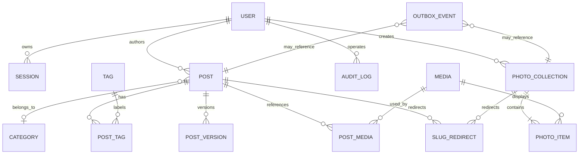

# Anywayone Blog 数据与 API 设计

## 1. 设计边界

本文定义 MVP 的逻辑数据模型和外部 API 契约。字段名用于表达意图，不代表最终 SQLAlchemy 模型必须逐字一致；实现时以 Alembic 迁移和 FastAPI 自动生成的 OpenAPI 为准。

原则：

- 数据库模型、领域模型和 API DTO 分离。
- 所有公开查询必须在服务端强制加入发布状态、可见性和删除状态条件。
- 文章版本、重定向、审计和 Outbox 属于一致性能力，不是可有可无的附属表。
- JSONB 只用于结构可能变化且不需要复杂关联的数据，不能替代清晰的关系模型。

## 2. 实体关系



## 3. 核心数据表

所有业务表默认包含 `id`、`created_at`、`updated_at`；以下只重复强调有业务语义的时间字段。

### 3.1 users

| 字段 | 类型 | 约束/说明 |
| --- | --- | --- |
| id | UUID | 主键 |
| email | varchar | 规范化后唯一 |
| display_name | varchar | 后台和作者信息展示 |
| password_hash | varchar | Argon2id 输出 |
| status | enum | `ACTIVE`、`LOCKED`、`DISABLED` |
| last_login_at | timestamptz | 可空 |
| password_changed_at | timestamptz | 用于会话失效判断 |

MVP 虽为单管理员，也不把配置和文章直接绑死在固定用户 ID 上，便于未来账号更换。公开注册不存在。

### 3.2 sessions

| 字段 | 类型 | 约束/说明 |
| --- | --- | --- |
| user_id | UUID | 外键 |
| token_hash | varchar | 只保存刷新令牌哈希，唯一 |
| token_family | UUID | 轮换与复用检测 |
| user_agent | varchar | 截断后保存，可空 |
| ip_hash | varchar | 可选，避免保存不必要的原始 IP |
| expires_at | timestamptz | 必填 |
| revoked_at | timestamptz | 可空 |
| last_used_at | timestamptz | 可空 |

### 3.3 posts

| 字段 | 类型 | 约束/说明 |
| --- | --- | --- |
| author_id | UUID | 外键 |
| category_id | UUID | 可空外键 |
| title | varchar(200) | 必填 |
| slug | varchar(200) | 活跃内容中唯一 |
| excerpt | text | 手写摘要，可空 |
| markdown | text | 内容源 |
| rendered_html | text | 安全渲染结果 |
| toc | jsonb | 标题目录的结构化结果 |
| cover_media_id | UUID | 可空外键 |
| cover_alt | varchar | 有封面时建议必填 |
| status | enum | `DRAFT`、`SCHEDULED`、`PUBLISHED`、`WITHDRAWN`、`ARCHIVED` |
| visibility | enum | `PUBLIC`、`UNLISTED` |
| is_pinned | boolean | 默认 false |
| allow_indexing | boolean | 默认 true；非公开状态强制 false |
| seo_title | varchar | 可空 |
| seo_description | varchar | 可空 |
| canonical_url | varchar | 可空，需 URL 校验 |
| reading_time_minutes | int | 服务端计算 |
| revision | int | 乐观锁版本号 |
| scheduled_at | timestamptz | 定时状态必填 |
| published_at | timestamptz | 首次发布时写入 |
| deleted_at | timestamptz | 软删除 |

推荐索引：

- 活跃记录 `slug` 部分唯一索引。
- `(status, published_at desc)`。
- `(category_id, status, published_at desc)`。
- `(status, scheduled_at)`，服务定时发布扫描。
- 搜索向量 GIN 或 `title/excerpt` 的 trigram 索引。

业务约束：

- `SCHEDULED` 必须有 `scheduled_at` 且晚于当前有效时间。
- `PUBLISHED` 必须有 `published_at`。
- `UNLISTED` 可通过地址访问，但不出现在首页、列表、搜索、RSS 和 sitemap。
- 公开 API 永不返回 `markdown`、内部备注或草稿元数据。

### 3.4 post_versions

| 字段 | 类型 | 约束/说明 |
| --- | --- | --- |
| post_id | UUID | 外键，删除文章时仍按保留策略处理 |
| version_no | int | 与 post 组合唯一 |
| snapshot | jsonb | 标题、Markdown、摘要及发布相关字段 |
| change_type | enum | `AUTO_SAVE`、`MANUAL_SAVE`、`PUBLISH`、`RESTORE` |
| created_by | UUID | 操作者 |
| source_version_id | UUID | 恢复版本时记录来源，可空 |

自动保存版本可按时间窗口保留，例如同一文章 10 分钟内只新增一个快照并更新其内容；显式保存和发布版本不可被合并。

### 3.5 categories

| 字段 | 类型 | 约束/说明 |
| --- | --- | --- |
| name | varchar | 规范化后唯一 |
| slug | varchar | 唯一 |
| description | text | 可空 |
| parent_id | UUID | 可空；首版最多两级或暂不开放层级 |
| sort_order | int | 默认 0 |
| deleted_at | timestamptz | 软删除 |

删除分类前必须处理已有文章：迁移到其他分类或设为未分类。

### 3.6 tags 与 post_tags

`tags` 包含 `name`、`slug`、`description`（可选）、`deleted_at`。`post_tags` 使用 `(post_id, tag_id)` 组合唯一约束。标签合并在事务内迁移关联，并为旧 Slug 建立重定向。

### 3.7 media

| 字段 | 类型 | 约束/说明 |
| --- | --- | --- |
| owner_id | UUID | 上传者 |
| storage_provider | varchar | `s3`、`local` 等 |
| object_key | varchar | 唯一，不使用原始文件名作为键 |
| original_name | varchar | 展示用途，需清洗 |
| mime_type | varchar | 服务端验证后的真实值 |
| size_bytes | bigint | 必填 |
| width / height | int | 图片可用，可空 |
| alt_text | varchar | 可空，但编辑器应提示 |
| checksum | varchar | 去重/完整性验证，可空 |
| status | enum | `PENDING`、`PROCESSING`、`READY`、`FAILED` |
| variants | jsonb | 缩略图、WebP/AVIF 等派生信息 |
| deleted_at | timestamptz | 软删除 |

`post_media` 显式记录文章对媒体的引用及用途，例如 `INLINE`、`COVER`。Markdown 每次保存后通过解析 token tree 同步引用，不使用正则扫描。摄影集通过下述 `photo_items` 引用同一媒体表，因此媒体删除检查必须同时覆盖文章和摄影集。

### 3.8 photo_collections 与 photo_items

`photo_collections` 表达一组有顺序、有共同主题的摄影作品：

| 字段 | 类型 | 约束/说明 |
| --- | --- | --- |
| author_id | UUID | 外键 |
| title | varchar(200) | 必填 |
| slug | varchar(200) | 活跃摄影集中唯一 |
| description | text | 简介，可空 |
| cover_media_id | UUID | 必须引用当前摄影集中的 READY 图片 |
| captured_from / captured_to | date | 拍摄日期范围，可空且起始不晚于结束 |
| location_text | varchar | 作者填写的概略地点，可空 |
| status | enum | `DRAFT`、`PUBLISHED`、`WITHDRAWN` |
| is_featured | boolean | 是否作为摄影页精选内容，默认 false；不进入首页 |
| allow_indexing | boolean | 默认 true；非发布状态强制 false |
| seo_title / seo_description | varchar | 可空 |
| canonical_url | varchar | 可空，需 URL 校验 |
| revision | int | 乐观锁版本号 |
| published_at | timestamptz | 首次发布时写入 |
| deleted_at | timestamptz | 软删除 |

`photo_items` 表达摄影集中的作品顺序和上下文：

| 字段 | 类型 | 约束/说明 |
| --- | --- | --- |
| collection_id | UUID | 外键 |
| media_id | UUID | 外键，只允许 READY 图片 |
| position | int | collection 内唯一，从 0 或 1 开始并全局统一 |
| title | varchar | 单张作品标题，可空 |
| alt_text | varchar | 无障碍替代文本，发布检查项 |
| caption | text | 面向读者的照片说明，可空 |

业务约束：摄影集发布时至少包含一张 READY 图片，封面必须属于当前摄影集，`position` 不可重复。同一媒体可以进入多个摄影集，但同一摄影集内默认不重复。摄影集 Slug 修改需要建立 308 重定向。

### 3.9 pages

P1 自定义独立页面与文章相似，但不需要分类、标签、定时发布和文章流排序。核心字段为 `title`、`slug`、`markdown`、`rendered_html`、`status`、SEO 字段、`revision` 和发布时间。关于我可先作为固定站点内容保存；进入 P1 后推荐独立 `pages` 表，降低 `posts` 中的大量条件分支。

### 3.10 slug_redirects

| 字段 | 类型 | 约束/说明 |
| --- | --- | --- |
| resource_type | enum | `POST`、`PHOTOGRAPHY`、`PAGE`、`CATEGORY`、`TAG` |
| resource_id | UUID | 目标资源 |
| old_path | varchar | 全站唯一 |
| new_path | varchar | 当前标准路径 |
| status_code | int | 默认 308 |

重定向写入前检测循环和路径占用。若目标再次改名，旧路径应直接指向最终路径，避免重定向链。

### 3.11 site_settings 与 social_links

`site_settings` 可使用“单行结构化配置 + schema version”，适合站点名称、简介、关于我正文、时区、默认 SEO、分页大小等低频设置。一级导航在首版固定为首页、文章、摄影、关于我，不建立可任意删除和排序的导航表。社交链接需要排序、启停和独立 ID，单独建表更适合管理。

设置变更需要：严格 DTO 校验、审计记录、缓存失效。敏感密钥不进入设置表，仍由部署环境注入。

### 3.12 audit_logs

| 字段 | 类型 | 约束/说明 |
| --- | --- | --- |
| actor_id | UUID | 操作者，可空表示系统任务 |
| action | varchar | 如 `post.publish` |
| resource_type / resource_id | varchar / UUID | 被操作对象 |
| request_id | varchar | 与应用日志关联 |
| summary | jsonb | 仅保存必要差异，不保存密码/令牌/完整正文 |
| ip_hash | varchar | 可选 |
| created_at | timestamptz | 只追加，不更新 |

### 3.13 outbox_events

| 字段 | 类型 | 约束/说明 |
| --- | --- | --- |
| event_type | varchar | 如 `PostPublished` |
| aggregate_type / aggregate_id | varchar / UUID | 聚合对象 |
| payload | jsonb | 事件所需的最小数据 |
| available_at | timestamptz | 可消费时间 |
| attempts | int | 重试次数 |
| processed_at | timestamptz | 成功后写入 |
| last_error | text | 截断并脱敏 |

消费成功后事件可定期归档或删除；未处理事件按年龄告警。

## 4. API 通用规范

### 4.1 基础约定

- 前缀：`/api/v1`。
- Content-Type：`application/json`；文件上传使用预签名 URL。
- ID：字符串形式 UUID。
- 时间：ISO 8601 UTC。
- 布尔、空值和空数组保持类型稳定，不用 `0/1` 或空字符串替代。
- 后台写请求携带 `X-Request-Id`（可选）和 CSRF 信息；服务端始终返回 requestId。

### 4.2 成功响应

单条资源直接放入 `data`：

```json
{
  "data": {
    "id": "0198e7f0-0000-7000-8000-000000000001",
    "title": "Hello Anywayone"
  },
  "meta": {
    "requestId": "req_01K..."
  }
}
```

分页列表：

```json
{
  "data": [],
  "meta": {
    "page": 1,
    "pageSize": 20,
    "total": 0,
    "totalPages": 0,
    "requestId": "req_01K..."
  }
}
```

### 4.3 错误响应

```json
{
  "error": {
    "code": "CONTENT_VERSION_CONFLICT",
    "message": "文章已在其他位置更新，请比较后重试。",
    "details": {
      "currentRevision": 12
    }
  },
  "meta": {
    "requestId": "req_01K..."
  }
}
```

错误码是稳定契约，`message` 可本地化。生产环境不返回堆栈、SQL 或内部对象信息。

### 4.4 HTTP 状态与错误码

| HTTP | 示例错误码 | 场景 |
| --- | --- | --- |
| 400 | `INVALID_REQUEST` | JSON 或通用请求格式错误 |
| 401 | `AUTH_REQUIRED`、`SESSION_EXPIRED` | 未登录或会话失效 |
| 403 | `FORBIDDEN`、`CSRF_INVALID` | 无权限或来源校验失败 |
| 404 | `POST_NOT_FOUND` | 资源不存在或对当前用户不可见 |
| 409 | `SLUG_CONFLICT`、`CONTENT_VERSION_CONFLICT` | 唯一约束或乐观锁冲突 |
| 413 | `FILE_TOO_LARGE` | 上传超过限制 |
| 422 | `VALIDATION_FAILED` | 字段校验未通过 |
| 429 | `RATE_LIMITED` | 请求过快 |
| 500 | `INTERNAL_ERROR` | 未预期错误 |
| 503 | `DEPENDENCY_UNAVAILABLE` | 必要依赖暂不可用 |

### 4.5 过滤、排序与分页

后台文章列表示例：

```text
GET /api/v1/admin/posts?page=1&pageSize=20&status=DRAFT&categoryId=...&q=typescript&sort=-updatedAt
```

- `page` 从 1 开始，`pageSize` 默认 20、最大 100。
- `sort=-updatedAt` 表示倒序，只允许服务端白名单字段。
- 筛选空值不与“未分类”等业务值混用。
- 公开列表只允许适合暴露的有限排序，防止任意查询拖垮数据库。

## 5. API 资源清单

以下为 MVP 资源级清单，详细请求/响应由 DTO 和 OpenAPI 补充。

### 5.1 认证 `/api/v1/auth`

| 方法 | 路径 | 用途 |
| --- | --- | --- |
| POST | `/login` | 登录并创建会话 |
| POST | `/refresh` | 轮换刷新令牌 |
| POST | `/logout` | 吊销当前会话并清理 Cookie |
| GET | `/me` | 获取当前管理员基础信息 |
| GET | `/sessions` | 查看活跃会话 |
| DELETE | `/sessions/{id}` | 注销指定设备会话 |

登录接口无论邮箱是否存在都返回一致的失败文案和近似处理时间。

### 5.2 公开内容 `/api/v1/public`

| 方法 | 路径 | 用途 |
| --- | --- | --- |
| GET | `/site` | 公开站点配置、固定导航描述、社交链接 |
| GET | `/posts` | 已发布公开文章列表 |
| GET | `/posts/{slug}` | 文章详情 |
| GET | `/photography` | 已发布摄影集列表 |
| GET | `/photography/{slug}` | 摄影集详情与有序照片 |
| GET | `/about` | 关于我内容与公开作者资料 |
| GET | `/categories` | 分类及公开文章计数 |
| GET | `/categories/{slug}/posts` | 分类文章列表 |
| GET | `/tags` | 标签及公开文章计数 |
| GET | `/tags/{slug}/posts` | 标签文章列表 |
| GET | `/archives` | 按年月聚合的归档 |
| GET | `/search` | 公开内容搜索 |
| GET | `/pages/{slug}` | P1 自定义独立页面 |
| GET | `/redirects/resolve?path=` | 可选；解析旧路径，亦可由 Web 内部调用 |

公开内容响应设置 ETag/Last-Modified，未修改返回 `304`。未列出文章通过精确 Slug 可访问，但不应被列表和搜索泄漏。摄影集详情只返回展示所需派生图地址、宽高、替代文本和说明，不返回对象存储内部键或未经选择的 EXIF。

### 5.3 文章管理 `/api/v1/admin/posts`

| 方法 | 路径 | 用途 |
| --- | --- | --- |
| GET | `/` | 管理列表与筛选 |
| POST | `/` | 新建草稿 |
| GET | `/{id}` | 获取完整编辑数据 |
| PATCH | `/{id}` | 自动/手动保存，携带 revision |
| POST | `/{id}/validate-publication` | 发布前检查 |
| POST | `/{id}/publish` | 立即发布，支持幂等键 |
| POST | `/{id}/schedule` | 定时发布 |
| POST | `/{id}/cancel-schedule` | 取消定时 |
| POST | `/{id}/withdraw` | 撤回 |
| POST | `/{id}/archive` | 归档 |
| POST | `/{id}/restore` | 从回收站恢复 |
| DELETE | `/{id}` | 移入回收站 |
| GET | `/{id}/versions` | 版本列表 |
| GET | `/{id}/versions/{versionId}` | 获取版本快照/差异数据 |
| POST | `/{id}/versions/{versionId}/restore` | 以旧版本生成新当前版本 |

状态变化使用动作端点而不是允许客户端任意 PATCH `status`，确保权限、校验、审计和事件完整执行。

保存示例：

```json
{
  "revision": 11,
  "title": "Hello Anywayone",
  "slug": "hello-anywayone",
  "markdown": "# Hello\n\nContent...",
  "excerpt": "第一篇文章",
  "categoryId": null,
  "tagIds": [],
  "seo": {
    "title": null,
    "description": null,
    "canonicalUrl": null,
    "allowIndexing": true
  }
}
```

返回新 `revision`、保存时间和服务端重新计算的渲染结果摘要。较大的 HTML 预览可使用独立预览接口或仅在需要时返回，避免每次自动保存传输过多数据。

### 5.4 分类与标签 `/api/v1/admin`

| 方法 | 路径 | 用途 |
| --- | --- | --- |
| GET/POST | `/categories` | 列表/创建分类 |
| PATCH/DELETE | `/categories/{id}` | 更新/删除分类 |
| POST | `/categories/{id}/move-posts` | 删除前迁移文章 |
| GET/POST | `/tags` | 列表/创建标签 |
| PATCH/DELETE | `/tags/{id}` | 更新/删除标签 |
| POST | `/tags/{id}/merge` | 合并到目标标签 |

删除和合并返回影响数量；执行时在事务中校验目标仍存在。

### 5.5 摄影集 `/api/v1/admin/photography`

| 方法 | 路径 | 用途 |
| --- | --- | --- |
| GET | `/` | 摄影集管理列表与筛选 |
| POST | `/` | 新建摄影集草稿 |
| GET | `/{id}` | 获取摄影集与有序照片 |
| PATCH | `/{id}` | 保存元数据与照片编排，携带 revision |
| POST | `/{id}/validate-publication` | 检查照片、封面、Slug 与 SEO |
| POST | `/{id}/publish` | 发布摄影集，支持幂等键 |
| POST | `/{id}/withdraw` | 撤回摄影集 |
| DELETE | `/{id}` | 移入回收站 |

保存时一次提交目标顺序，服务端在事务中验证 item ID 集合、媒体状态和 position 唯一性。首版不提供摄影集定时发布和版本历史；revision 仍防止多标签页静默覆盖。

### 5.6 媒体 `/api/v1/admin/media`

| 方法 | 路径 | 用途 |
| --- | --- | --- |
| GET | `/` | 媒体列表、搜索和引用筛选 |
| POST | `/upload-intents` | 创建媒体记录和预签名上传 |
| POST | `/{id}/complete` | 确认上传完成 |
| GET | `/{id}` | 媒体详情及引用 |
| PATCH | `/{id}` | 更新替代文本等元数据 |
| DELETE | `/{id}` | 未引用时删除/移入回收站 |

上传意图请求必须包含 `fileName`、`contentType`、`sizeBytes` 和可选 `checksum`。服务端生成对象键，不接受客户端指定完整存储路径。

### 5.7 页面、设置与社交链接

- `GET/PATCH /api/v1/admin/about` 读取和保存关于我内容，发布后失效 `/about` 缓存。
- P1 独立页面 API 与文章类似，但只保留草稿、发布、撤回和版本能力。
- `GET/PATCH /api/v1/admin/settings/{section}` 分区读取与保存设置。
- `GET/POST/PATCH/DELETE /api/v1/admin/social-links` 管理社交入口。

首版一级导航不提供写 API，固定结构由 Web 路由与产品配置共同保证。

### 5.8 运维与审计

| 方法 | 路径 | 用途 |
| --- | --- | --- |
| GET | `/api/v1/admin/audit-logs` | 查询关键操作 |
| POST | `/api/v1/admin/exports` | 创建内容导出任务 |
| GET | `/api/v1/admin/exports/{id}` | 查询状态并获取短期下载地址 |
| GET | `/api/v1/admin/system/status` | 版本、依赖与任务状态摘要 |
| GET | `/health/live` | 存活检查 |
| GET | `/health/ready` | 就绪检查 |

管理端不直接触发任意服务器命令。备份操作若由部署系统承担，后台只展示状态与文档入口，不伪造“备份成功”。

## 6. 权限矩阵

MVP 只有管理员和匿名访问两类权限，但仍显式定义：

| 资源/操作 | 匿名读者 | 管理员 | 系统任务 |
| --- | --- | --- | --- |
| 公开文章/页面 | 读 | 读 | 读 |
| 未列出文章 | 知道精确地址时读 | 读写 | 读 |
| 草稿/定时/撤回内容 | 无 | 读写 | 按任务读取 |
| 已发布摄影集 | 读 | 读写 | 读 |
| 草稿/撤回摄影集 | 无 | 读写 | 按任务读取 |
| 分类/标签公开信息 | 读 | 读写 | 读 |
| 媒体 | 仅公开引用资源 | 读写 | 处理派生图 |
| 站点公开设置 | 读 | 读写 | 读 |
| 认证会话 | 无 | 仅管理本人会话 | 清理过期会话 |
| 审计日志 | 无 | 读 | 写 |
| Outbox/定时任务 | 无 | 仅查看摘要 | 读写 |

未来增加角色时，优先按能力权限（如 `post:publish`）扩展，不在 FastAPI 路由中散落角色名称判断。

## 7. 并发与事务规则

- 编辑保存：乐观锁，revision 冲突返回 409，不做最后写入者静默覆盖。
- 发布：文章或摄影集状态更新、审计摘要、Outbox 同一事务提交；文章同时写版本。
- 摄影排序：摄影集 revision 校验、item 集合与 position 更新同一事务。
- 标签合并：目标校验、关联迁移、重定向、源标签删除同一事务。
- Slug 修改：唯一性校验、重定向和资源更新同一事务；仍需捕获数据库唯一冲突。
- 上传完成：对象实际存在且校验通过后才能从 `PENDING` 进入 `PROCESSING/READY`。
- 删除媒体：在事务中检查引用；对象物理删除通过任务异步执行并可重试。

## 8. 数据保留与清理

| 数据 | 建议策略 |
| --- | --- |
| 文章与页面版本 | 发布版本长期保留；自动保存按数量/时间清理 |
| 摄影集元数据 | 随摄影集长期保留；回收站策略与文章一致 |
| 回收站内容 | 默认 30 天后允许物理清理，清理前进入备份 |
| 已吊销会话 | 到期后保留短期安全审计，再清理 |
| 审计日志 | 至少 180 天，按个人隐私需求调整 |
| 已处理 Outbox | 保留 7-30 天便于排障，然后归档/清理 |
| 失败上传 | 24 小时后清理无主对象与 PENDING 记录 |
| 原始访问事件 | 尽量不保存；使用日级聚合并缩短 IP 相关数据寿命 |

物理清理任务必须有 dry-run/统计能力、批量上限和审计记录，禁止一次无边界删除。

## 9. OpenAPI 与客户端生成

- FastAPI 路由显式声明 Pydantic 请求模型与 `response_model`，由应用自动输出 OpenAPI。
- 使用 Pydantic alias generator 统一对外 `camelCase`，Python 内部保持 `snake_case`，禁止逐字段手工转换。
- CI 启动应用导出 OpenAPI，校验 schema 可生成客户端且不存在破坏性未说明变化。
- `packages/api-client` 从规范生成基础类型和请求函数，管理端与 Web 不手写重复接口类型。
- 生成代码与业务查询 hooks 分开；应用层可在生成客户端上包装缓存键、错误翻译和取消请求。
- 公开 API 和管理 API 可在同一规范分 tag，也可输出两个规范文件，确保管理接口不会被误当作公开 SDK。
